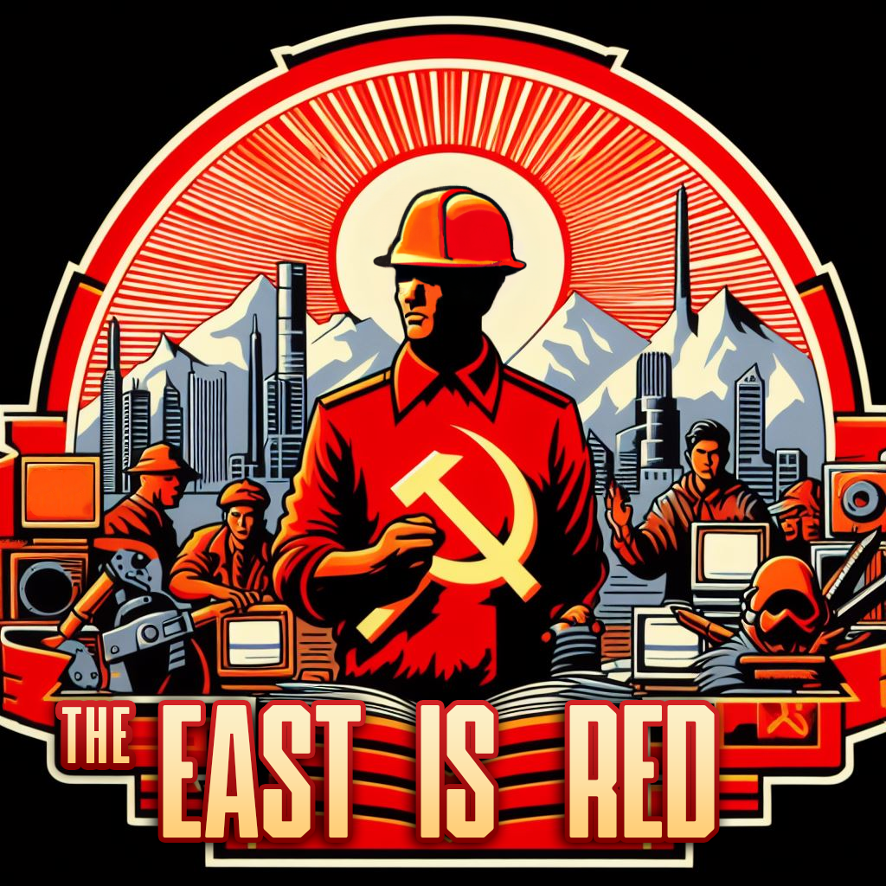

# The East is Red  
submod for CWP for Victoria 3  

  

Game Version: 1.4  
## current version: 0.08.49  
versions are x.y.z  
x = 1 at release, 0 before  
y = how many features have been added  
z = how many features are planned  
all numbers ordinal, not cardinal  

This mod aims to expand the mechanics for the socialist countries in the game including alternate technologies and production methods that were not explored in our time line for one reason or another.

Many of the additions are not unique to the socialist countries but are inspired by a socialist modus operandi, one of the main reasons they were not adopted in the capitalist countries.

Socialist mega projects, cybernetics, transformations of government, and many other things are added. Largely these ideas come from contemporary socialist movements or previous socialist experiments.

TOTAL POINTS : 49

- [ ] Laws  27 points
	- [ ] Quotas  12 points  
		Many countries both socialist and capitalist implement(ed) quotas in their legislatures for certain minority groups. Women being the most typical example. Quotas in this submod are divided into Gender, Ethnic, and Worker.

		Socialist countries in the past and present often have a specific number of their seats reserved for trade union federations, women's federations, farmers unions, etc. These are what are represented by the workers quotas.

		Many capitalist countries often had quotas for women. Proportional electoral systems implement this much easier via "zipper lists"

		There are also many examples of systems guaranteeing seats to ethnic minorities in one way or another (New Zealand does this with the Maori)

		Quotas will need to be in 3 categories as they are not mutually exclusive
		- [ ] women  5 points
			possible values:
			- [ ] only men
			- [ ] no quotas
			- [ ] 1/4 women
			- [ ] half women
			- [ ] only women
		- [ ] ethnicities  3 points
			- [ ] only main ethnic group (South  Africa, Israel)
			- [ ] no quotas
			- [ ] proportional quotas
		- [ ] workers  4 points
			- [ ] Landed aristocrats have seats (House of Lords)
			- [ ] corporations have seats (modern and historic Hong Kong does this)
			- [ ] no quotas
			- [ ] trade union federation seats

	- [ ] Sortition  3 points  
		Sortition is picking government seats by lottery. It is the original meaning of the word "democracy". Elections were historically seen as tools for aristocrats and simple popularily contests to placate the masses. Many have returned to the idea as a way of solving the problems of modern politics.

		There were multiple ways sortition was handled.
		- [ ] No sortition
		- [ ] Sortition among winners (a single winner out of multiple is randomly chosen)
		- [ ] Sortition (jury duty style)

	- [ ] Boarding Schools  
		many socialist and anarchist projects sought to destroy the oppressive and patriarchal family unit by communally raising children in large daycare/schools  1 points

	- [ ] Electoral Campaigns  4 points  
		- [ ] None
		- [ ] Neighborhood Delegate Nominations  
			(Cuba has this system)
		- [ ] Publicly Funded Elections  
			(New Zealand has this system)
		- [ ] Private Campaign Contributions  
			(The United States has this to the extreme, bribery is basically legal.)

	- [ ] Electoral Districts  5 points  
		- [ ] Gerrymandering
		- [ ] Independent Committee
		- [ ] Shortest Split-Line
		- [ ] Historical Boundaries
		- [ ] Single nation-wide district

	- [ ] Banking  3 points  
		- [ ] Private retail banking
		- [ ] Postal banking
		- [ ] State controlled banking

- [ ] Institutions  1 points  
	- [ ] boarding schools  
		(See law)

- [ ] Buildings  17 points  
	- [ ] Mega projects  5 points  
		- [x] Solar Satellite Array
		- [x] Spirulina Farms
		- [ ] Orbiting Telescope
		- [ ] GPS
		- [ ] Cybersyn
	- [ ] New Buildings  9 points
		- [x] Rocket Factory
		- [ ] Launch Site
			- [ ] standard
			- [ ] shuttle
			- [ ] re-usable rocket
		- [ ] Post Office
			- [ ] Email production method
			- [ ] Computer Handwriting Recognition production method
			- [ ] Vaccum tube production method
	- [ ] New Production Methods  3 points
		- [x] Thorium Reactor (nuclear power)
		- [x] Breeder Reactor (nuclear power)
		- [ ] Cybernetics (all industries)
		- [x] Alternate Protein (food industries)

- [x] Goods  4 points
	- [x] deliveries (post office)
	- [x] alt protein
	- [x] launches
	- [x] rockets
